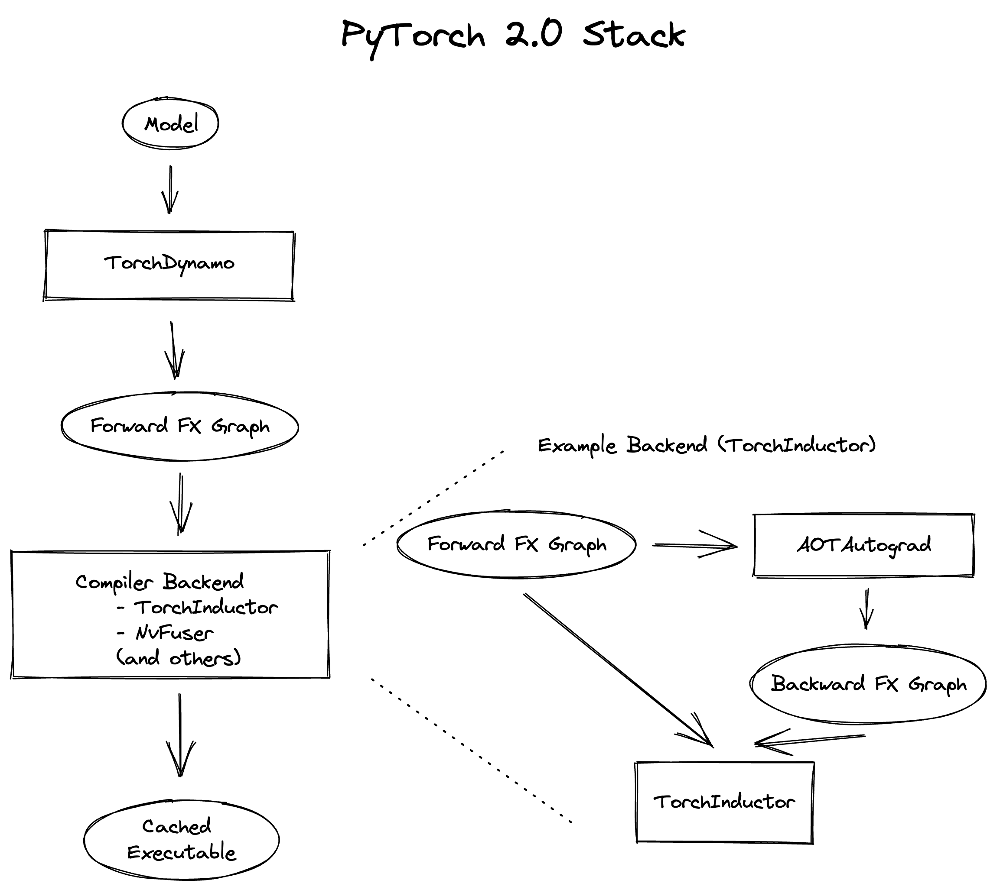
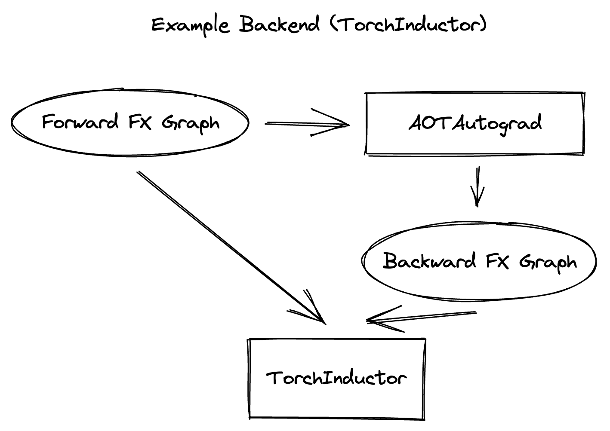

# Troubleshooting

Torchdynamo is still in active development, and many of the reasons for graph breaks and excessive recompilation will be fixed with upcoming support for [tracing dynamic tensor shapes](https://docs.google.com/document/d/1QJB-GOnbv-9PygGlOMXwiO9K6vVNm8sNg_olixJ9koc/edit?usp=sharing), more careful choices for guards and better tuned heurstics.

In the mean time, you may need to diagnose a particular issue and determine if it is easy to work around with a change to your model, or file an issue for support.

We're also actively developing debug tools, profilers, and improving our errors/warnings.  Please give us feedback if you have an issue with this infra, or an idea for an improvement.

## Graph Breaks
Given a program like this,

```
with torchdynamo.optimize(...):
   some_fun(x)
   ...
```

Torchdynamo will attempt to compile all of the torch/tensor operations within some_fun into a single FX graph, but it may fail to capture everything into one graph.

Some graph break reasons are insurmountable to torchdynamo, and can't be easily fixed.
- calling into a C extension other than torch is invisible to torchdynamo, and could do arbitrary things without torchdynamo being able to introduce necessary guards to ensure that the compiled program would be safe to reuse

### Identifying the cause of a graph break

To identify all graph breaks in a program and the associated reasons for the breaks, `torchdynamo.explain` can be used. This tool runs Torchdynamo on the supplied function and aggregates the graph breaks that are encountered. Here is an example usage:

```python
from typing import List
import torch
import torchdynamo

def toy_example(a, b):
    x = a / (torch.abs(a) + 1)
    print("woo")
    if b.sum() < 0:
        b = b * -1
    return x * b

explained = torchdynamo.explain(toy_example, torch.randn(10), torch.randn(10))
print(explained[0])

"""
Dynamo produced 3 graphs, with 2 graph break and 6 ops. 
 Break reasons: 

1. call_function BuiltinVariable(print) [ConstantVariable(str)] {} 
   File "t2.py", line 16, in toy_example
    print("woo")
 
2. generic_jump 
   File "t2.py", line 17, in toy_example
    if b.sum() < 0:
 """
```

To throw an error on the first graph break encountered, `nopython` mode can be used. This disables Torchdynamo's python fallback, and only succeeds if the entire program is convertible to a single graph. Example usage:

```python
@torchdynamo.optimize(<compiler>, nopython=True)
def toy_example(a, b):
   ...
```

## Diagnosing Runtime Errors
Below is the PyTorch 2.0 stack. 



At a high level, the PyTorch 2.0 stack consists of a graph capture from Python code (TorchDynamo) and a backend compiler. In this example the backend compiler consists of backward graph tracing (AOTAutograd) and graph lowering (TorchInductor)*. Errors can occur in any component of the stack and will provide full stack traces, but there are backends which enable users to run each component of the stack without the others enabled to narrow down the exact component which is causing the error.

There are some backend options which can enable you to determine which component is causing the error if you're unable to understand the error message that is generated. These are the following:

- `"eager"`: only runs torchdynamo forward graph capture and then runs the captured graph with PyTorch. This provides an indication as to whether torchdynamo is raising the error.

- `"aot_nop"`: runs torchdynamo to capture a forward graph, and then AOTAutograd to trace the backward graph without any additional backend compiler steps. PyTorch eager will then be used to run the forward and backward graphs. This is useful to narrow down the issue to AOTAutograd.

The general procedure to narrow down an issue is the following:
1. Run your program with the `"eager"` backend. If the error no longer occurs, the issue is in the backend compiler that is being used (if using TorchInductor, proceed to step 2, if not, see [this section](#backend-compiler-errors)). If the error still occurs with the `"eager"` backend, it is an [error while running torchdynamo](#torchdynamo-errors).

2. This step is only necessary if TorchInductor is used as the backend compiler. Run the model with the `"aot_nop"` backend. If this backend raises an error then the error is occurring during AOTAutograd tracing. If the error no longer occurs with this backend, then [the error is in TorchInductor*](#torchinductor-errors).

Each of these cases are analyzed in the following sections.

*Note on TorchInductor naming: The TorchInductor backend consists of both AOTAutograd tracing and the TorchInductor compiler itself. We will disambiguate by referring to TorchInductor as the backend, and TorchInductor lowering as the phase which lowers the graph traced by AOTAutograd. 

### Torchdynamo Errors
If the error that is generated occurs with the `"eager"` backend, then torchdynamo is the most likely source of the error. Here is example code which will generate an error.

```
import torch

import torchdynamo


@torchdynamo.optimize("eager")
def test_assertion_error():
    y = torch.ones(200, 200)
    z = {y: 5}
    return z


test_assertion_error()
```

Which will generate the following error:

```
torchdynamo.convert_frame: [ERROR] WON'T CONVERT test_assertion_error /scratch/mlazos/torchdynamo/../test/errors.py line 26 
due to: 
Traceback (most recent call last):
  File "/scratch/mlazos/torchdynamo/torchdynamo/symbolic_convert.py", line 837, in BUILD_MAP
    assert isinstance(k, ConstantVariable) or (
AssertionError

from user code:
   File "/scratch/mlazos/torchdynamo/../test/errors.py", line 34, in test_assertion_error
    z = {y: 5}

Set torchdynamo.config.verbose=True for more information
==========
```

As the message suggests you can set `torchdynamo.config.verbose=True` to get a full stack trace to both the error in torchdynamo and the user code. In addition to this flag, you can also set the `log_level` of torchdynamo through `torchdynamo.config.log_level`. The available levels are the following:
- `logging.DEBUG`: Print every instruction that is encountered in addition to all below log levels
- `logging.INFO`: Print each function that is compiled (original and modified bytecode) and the graph that is captured in addition to all below log levels
- `logging.WARNING` (default): Print graph breaks in addition to all below log levels
- `logging.ERROR`: Print errors only

If a model is sufficiently large, the logs can become overwhelming. If an error occurs deep within a model's python code, it can be useful to execute only the frame in which the error occurs to enable easier debugging. There are two tools available to enable this. Setting the environment variable TORCHDYNAMO_DEBUG_FUNCTION to the desired function name will only run torchdynamo on functions with that name. Additionally there is a record/replay tool [being developed](https://github.com/pytorch/torchdynamo/pull/1089) which dumps an execution record when an error is encountered. This record can then be replayed to run only the frame where an error occurred.


### TorchInductor Errors
If the error doesn't occur with the `"eager"` backend, then the backend compiler is the source of the error ([example error](https://gist.github.com/mlazos/2f13681e3cc6c43b3911f336327032de])). There are [different choices](https://github.com/pytorch/torchdynamo/blob/0b8aaf340dad4777a080ef24bf09623f1aa6f3dd/README.md#existing-backends) for backend compilers for torchdynamo, with torchinductor or nvfuser fitting the needs of most users. This section focuses on torchinductor as the motivating example, but some tools will be usable with other backend compilers. 

Below is the portion of the stack which we are focusing on:



With torchinductor as the chosen backend, AOTAutograd is used to generate the backward graph from the forward graph captured by torchdynamo. It's important to note that errors can occur during this tracing and also while torchinductor lowers the forward and backward graphs to GPU code or C++. A model can often consist of hundreds or thousands of FX nodes, so narrowing the exact nodes where this problem occurred can be very difficult. Fortunately, there are tools availabe to automatically minify these input graphs to the nodes which are causing the issue the issue. The first step is to determine whether the error occurs during tracing of the backward graph with AOTAutograd or during TorchInductor lowering. As mentioned above in step 2, the `"aot_nop"` backend can be used to run only AOTAutograd in isolation without lowering. If the error still occurs with this backend, this indicates that the error is occurring during AOTAutograd tracing.

Here's an example:

```py
import torch

import torchdynamo

model = torch.nn.Sequential(*[torch.nn.Linear(200, 200) for _ in range(5)])

@torchdynamo.optimize("inductor")
def test_backend_error():

    y = torch.ones(200, 200)
    x = torch.ones(200, 200)
    z = x + y
    a = torch.ops.aten._foobar(z)  # dummy function which errors
    return model(a)


test_backend_error()
```

Running this should give you this error (with a longer stack trace below it)
```
Traceback (most recent call last):
  File "/scratch/mlazos/torchdynamo/torchinductor/graph.py", line 246, in call_function
    return lowerings[target](*args, **kwargs)
  File "/scratch/mlazos/torchdynamo/torchinductor/lowering.py", line 185, in wrapped
    return decomp_fn(*args, **kwargs)
  File "/scratch/mlazos/torchdynamo/torchinductor/lowering.py", line 810, in _foobar
    assert False
AssertionError

... 
```
[error with full stack trace](https://gist.github.com/mlazos/d6947854aa56d686800259a164c62100)

If you then change `@torchdynamo.optimize("inductor")` to `@torchdynamo.optimize("aot_nop")`, it will run without error, because [the issue](https://github.com/pytorch/torchdynamo/blob/d09e50fbee388d466b5252a63045643166006f77/torchinductor/lowering.py#:~:text=%23%20This%20shouldn%27t%20be,assert%20False) is in the TorchInductor lowering process, not in AOTAutograd.

From here, let's run the minifier to get a minimal repro.  Setting the environment variable TORCHDYNAMO_REPRO_AFTER="aot" (or setting `torchdynamo.config.repro_after="aot"` directly) will generate a python program which reduces the graph produced by AOTAutograd to the smallest subgraph which reproduces the error. (See below for an example where we minify the graph produced by torchdynamo) Running the program with this environment variable should show nearly [identical output](https://gist.github.com/mlazos/0458ab828aa403c779fe73c012aa5982), with an additional line indicating where `minifier_launcher.py` has been written to. The output directory is configurable by setting `torchdynamo.config.base_dir` to a valid directory name. The final step is to run the minifier and check that it runs successfully. A successful run looks like (this)[https://gist.github.com/mlazos/e6ea41ccce68a7b1b8a7a09acb1b206a]. If the minifier runs successfully, it generates runnable python code which reproduces the exact error. For our example this is the following code:

```py
import torch
from torch import tensor, device
import torch.fx as fx
from torchdynamo.testing import rand_strided
from math import inf
from torch.fx.experimental.proxy_tensor import make_fx

# torch version: 1.13.0a0+gitfddfc44
# torch cuda version: 11.6
# torch git version: fddfc4488afb207971c54ad4bf58130fdc8a4dc5


# CUDA Info: 
# nvcc: NVIDIA (R) Cuda compiler driver 
# Copyright (c) 2005-2022 NVIDIA Corporation 
# Built on Thu_Feb_10_18:23:41_PST_2022 
# Cuda compilation tools, release 11.6, V11.6.112 
# Build cuda_11.6.r11.6/compiler.30978841_0 

# GPU Hardware Info: 
# NVIDIA A100-SXM4-40GB : 8 


from torch.nn import *
class Repro(torch.nn.Module):
    def __init__(self):
        super().__init__()

    
    
    def forward(self, add):
        _foobar = torch.ops.aten._foobar.default(add);  add = None
        return (_foobar,)
        
args = [((200, 200), (200, 1), torch.float32, 'cpu')]
args = [rand_strided(shape, stride, dtype, device) for shape, stride, dtype, device in args]
mod = make_fx(Repro())(*args)

from torchinductor.compile_fx import compile_fx_inner

compiled = compile_fx_inner(mod, args)
compiled(*args)
```

The `forward` method of the `Repro` module contains the exact op which causes the issue. When filing an issue, please include any minified repros to aid in debugging.


### Backend Compiler Errors
With backend compilers other than TorchInductor the prcoess for finding the subgraph causing the error is nearly identical to the procedure in [errors in TorchInductor](#torchinductor-errors) with two important caveats. Namely, that the minifier will now be run on the graph that is traced by TorchDynamo, not the output graph of AOTAutograd.  Let's walk through an example. 

```py
import torch

import torchdynamo

model = torch.nn.Sequential(*[torch.nn.Linear(200, 200) for _ in range(5)])

# toy compiler which fails if graph contains relu
def toy_compiler(gm: torch.fx.GraphModule, _):
    for node in gm.graph.nodes:
        if node.target == torch.relu:
            assert False

    return gm


@torchdynamo.optimize(toy_compiler)
def test_backend_error():
    y = torch.ones(200, 200)
    x = torch.ones(200, 200)
    z = x + y
    a = torch.relu(z)
    return model(a)


test_backend_error()
```

Running this program with TORCHDYNAMO_REPRO_AFTER="dynamo" (or `torchdynamo.config.repro_after="dynamo"`) should produce [this output](https://gist.github.com/mlazos/244e3d5b53667e44078e194762c0c92b) and the following code in `repro.py`. 

```py
import torch
import torchdynamo
from torch import tensor, device
import torch.fx as fx
from torchdynamo.testing import rand_strided
from math import inf
from torchdynamo.debug_utils import run_fwd_maybe_bwd


from torch.nn import *
class Repro(torch.nn.Module):
    def __init__(self):
        super().__init__()

    
    
    def forward(self, add):
        relu = torch.relu(add);  add = None
        return (relu,)
        

mod = Repro().cuda()
opt_mod = torchdynamo.optimize("None")(mod)


args = [((200, 200), (200, 1), torch.float32, 'cpu', False)]
args = [rand_strided(sh, st, dt, dev).requires_grad_(rg) for (sh, st, dt, dev, rg) in args]


with torch.cuda.amp.autocast(enabled=False):
    ref = run_fwd_maybe_bwd(mod, args)
    res = run_fwd_maybe_bwd(opt_mod, args)
```

The minifier successfully reduced the graph to the op that raises the error in `toy_compiler`.
The other difference from the above procedure is that the minifier is automatically run after encountering a backend compiler error. After a successful run, the minifier writes `repro.py` to `torchdynamo.config.base_dir`.


## Excessive Recompilation
When torchdynamo compiles a function (or part of one), it makes certain assumptions
about locals and globals in order to allow compiler optimizations, and expresses these
assumptions as guards that check particular values at runtime.  If any of these guards
fail, Dynamo will recompile that function (or part) up to `torchdynamo.config.cache_size_limit` times.  If your program is hitting the cache limit, you will first need to determine which guard is failing and what part of your program is triggering it.

The [recompilation profiler](#recompilation-profiler) automates the process of setting torchdynamo's cache limit to 1 and running your program under an observation-only 'compiler' that records the causes of any guard failures.  You should be sure to run your program for at least as long (as many iterations) as you were running when you ran into trouble, and the profiler will accumulate statistics over this duration.

If your program exhibits a bounded amount of dynamism, you may be able to tune the torchdynamo cache limit to allow for each variation to be compiled and cached, but if the cache limit is too high you may find the cost of recompilation outweighs any optimization benefits.

```
torchdynamo.config.cache_size_limit = <your desired cache limit>
```

Torchdynamo plans to support many common cases of dynamic tensor shapes, such as varying batch size or sequence length.  It does not plan to support rank-dynamism.  In the mean time, setting a specific cache limit can be used in coordination with bucketing techniques to achieve an acceptable number of recompilations for some dynamic models.

```
prof = torchdynamo.utils.CompilationProfiler()
with torchdynamo.optimize(prof):
   my_model()
print(prof.report())
```


## File an Issue
You should feel encouraged to [file a github issue](https://github.com/pytorch/torchdynamo/issues) and expect a timely response.

Before filing an issue, read over the README.md, TROUBLESHOOTING.md, and search for similar issues.

When filing an issue, please include
- a minimal repro script if possible
- a description of the error
- the expected behavior
- a log (set `torchdynamo.config.log_file` to a valid file name to dump the logs to a file and `torchdynamo.config.log_level=logging.DEBUG`)
- your OS/python/pytorch version
