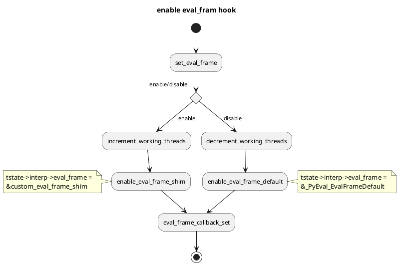
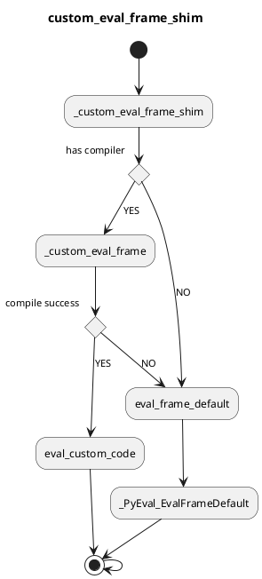

```plantuml
@startuml
title enable eval_fram hook

(*) --> "set_eval_frame"

if "enable/disable" then
    -->[enable] "increment_working_threads"
    --> "enable_eval_frame_shim"
    note left: tstate->interp->eval_frame = \n&custom_eval_frame_shim
    --> "eval_frame_callback_set"
else
    -->[disable] "decrement_working_threads"
    --> "enable_eval_frame_default"
    note right: tstate->interp->eval_frame = \n&_PyEval_EvalFrameDefault
    --> "eval_frame_callback_set"
endif

"eval_frame_callback_set" --> (*)

@enduml
```

```plantuml
@startuml
title custom_eval_frame_shim

(*) --> "_custom_eval_frame_shim"
if "has compiler" then
-->[YES] "_custom_eval_frame"
    if "compile success" then
        -->[YES] "eval_custom_code"
        --> (*)
    else
        -->[NO] "eval_frame_default"
    endif
else
-->[NO] "eval_frame_default"
--> "_PyEval_EvalFrameDefault"
-->(*)
endif
-->(*)

@enduml
```